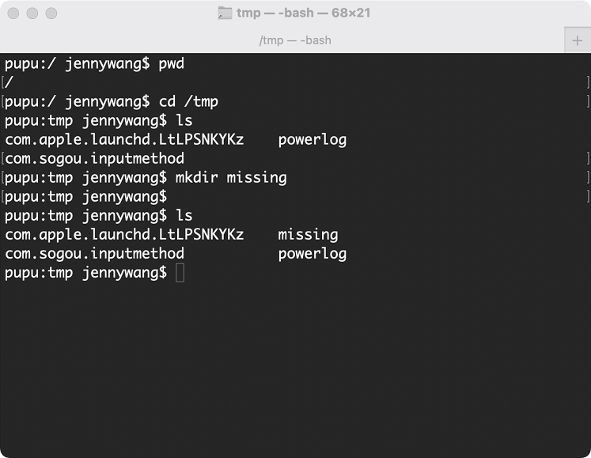
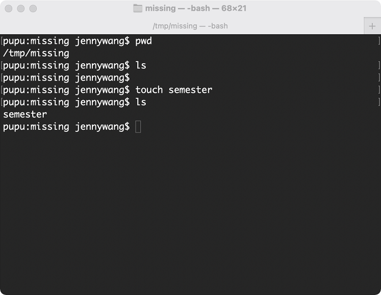
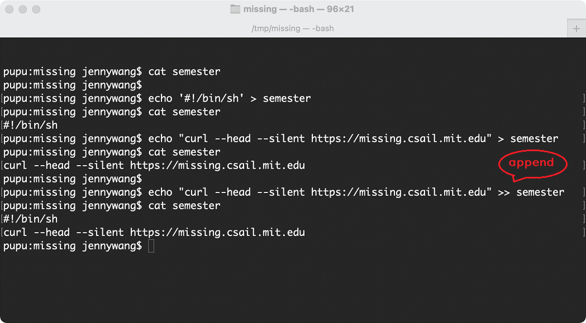
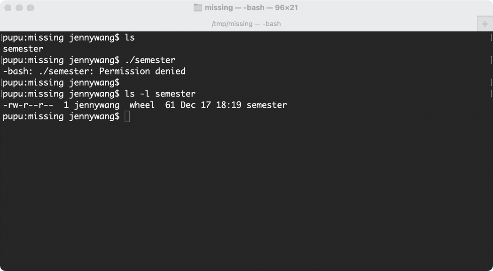
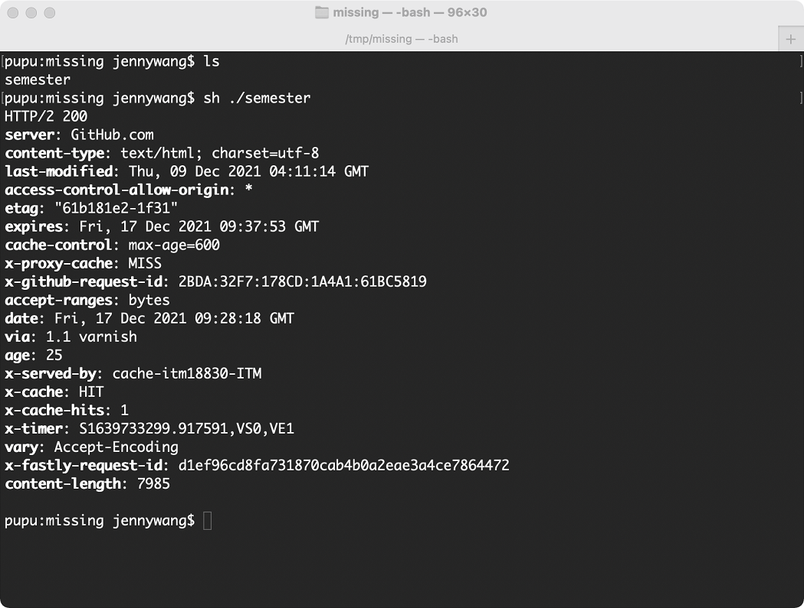
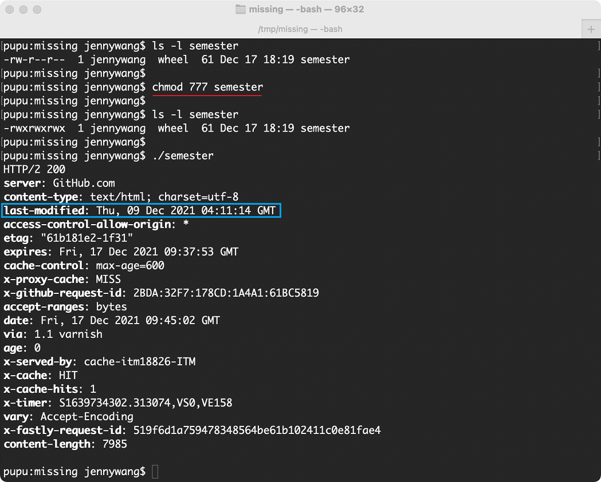
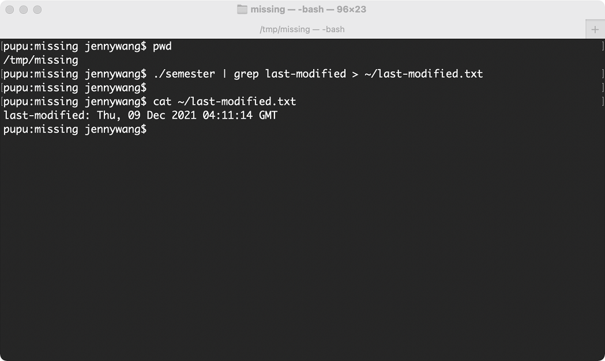

# Exercises

2. Create a new directory called `missing` under `/tmp`.



3. Look up the `touch` program.

```bash
$ man touch
```

4. Use `touch` to create a new file called `semester` in `missing`.



5. Write the following into that file, one line at a time:

```bash
#!/bin/sh
curl --head --silent https://missing.csail.mit.edu
```

Useful info:

a) `#` starts a comment in Bash.

b) `!` has a special meaning even within double-quoted (") strings. Ref [Bash quoting](https://www.gnu.org/software/bash/manual/html_node/Quoting.html) manual page.



6. Try to execute the file, i.e. type the path to the script (`./semester`) into your shell and press enter. Understand why it doesn’t work by consulting the output of `ls` (hint: look at the permission bits of the file).



Users of this `semester` file only have read permission, and have no execute permission.

7. Run the command by explicitly starting the `sh` interpreter, and giving it the file `semester` as the first argument, i.e. `sh semester`. Why does this work, while `./semester` didn’t?



The `sh` command invokes the default shell and uses its syntax and flags. The shell linked to the `/usr/bin/sh` path is the default shell.

8. Look up the `chmod` program.

```bash
man chmod
```

9. Use `chmod` to make it possible to run the command .`/semester` rather than having to type `sh semester`. How does your shell know that the file is supposed to be interpreted using sh? See this page on the [shebang](https://en.wikipedia.org/wiki/Shebang_(Unix)) line for more information.

- **Hash-bang** (#!) tells the program loader to use `/bin/sh` interpreter to run this `semester` script.



10. Use `|` and `>` to write the “last modified” date output by `semester` into a file called `last-modified.txt` in your `home` directory.



11. Write a command that reads out your laptop battery’s power level or your desktop machine’s CPU temperature from /sys. Note: if you’re a macOS user, your OS doesn’t have sysfs, so you can skip this exercise.
